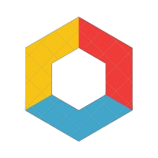

# KitchenAI

<p align="center">
  
</p>

**KitchenAI** is a control plane for AI implementations — designed to bridge the gap between application developers and AI teams. Our platform simplifies AI integration with a loosely coupled, modular architecture that delivers production-grade reliability while letting your teams focus on what they do best.

---

## 🚀 Quick Start

- **Explore Our Interactive Playground:**  
  [Try KitchenAI in Action](https://playground.kitchenai.dev/apps/playground)
- **Take a Guided Tour:**  
  [Watch the Guided Tour](https://app.arcade.software/share/j5ORenX65H5xuZWRppR4)

---

## 🌟 What Makes KitchenAI Unique

### Modular Architecture
- **Bento Boxes:** Package your AI workflows into independent "bento boxes" that encapsulate complex logic.  
- **Flexibility:** Update, replace, or scale individual modules without disrupting your overall system.  
- **Clear Separation:** Let AI teams build advanced logic in a reproducible and swappable space, while app developers enjoy a simple, stable API.

### High-Performance Messaging
- **Powered by NATS:**  
  - Lightning-fast, reliable communication between AI modules  
  - Dynamic service discovery and routing  
  - Robust support for event-driven workflows in distributed environments

### Framework Agnostic
- **Plug & Play:**  
  - No vendor lock-in—integrate with any AI framework or model  
  - Native support for LangChain, LlamaIndex, and custom implementations  
  - Future-proof your AI infrastructure with flexible integration options

---

## 🛠️ How It Works

KitchenAI’s three-layer architecture makes it easy to manage your AI workflows:

1. **Application Layer:**  
   Your business applications call a simple, unified API (just like using OpenAI’s Chat Completions).
   
2. **NATS Messaging Layer:**  
   This is our high-performance backbone for routing messages and discovering services dynamically.
   
3. **Bento Boxes Layer:**  
   Modular AI implementations where your AI team builds the complex logic (be it LLM logic, RAG, agents, or custom workflows).

### For Application Developers
Your code remains clean and simple:

```python
    # Simple integration using OpenAI's Chat Completions
    response = await openai_client.chat.completions.create(
        model="@llama-index-agents/query", #your bento box client id 
        messages=[{"role": "user", "content": data.query}]
    )
```

### For AI Teams
Focus on building powerful AI code:

```python
@kitchen.query.handler("query")
async def query_handler(data: WhiskQuerySchema) -> WhiskQueryBaseResponseSchema:
    # Advanced RAG implementation with best practices built-in
    index = VectorStoreIndex.from_vector_store(vector_store)
    query_engine = index.as_query_engine(
        chat_mode="best",
        filters=filters,
        llm=llm,
        verbose=True
    )
```

---

## 📚 Documentation

- [Getting Started](https://kitchenai.dev/docs/getting-started)
- [Core Concepts](https://kitchenai.dev/docs/core-concepts)
- [Deployment Guide](https://kitchenai.dev/docs/deployment)
- [API Reference](https://kitchenai.dev/docs/api-reference)

---

## 🛠️ Key Features

- **Version Control & Rollback:** Safely iterate and revert as needed.
- **Monitoring & Observability Hooks:** Integrate with your favorite tools.
- **Plugin Ecosystem:** Extend KitchenAI with additional capabilities.
- **Security Integrations:** Designed with production-grade best practices.

---

## 🙋‍♂️ Join the Beta!

KitchenAI is still in beta—we're excited to have early adopters help shape the platform.  
- **Join the Waitlist:** [Get Early Access](https://kitchenai.dev/#waitlist)  
- **Play in Our Playground:** [Try it out now](https://playground.kitchenai.dev)

---

## 🔗 Quick Links

- [Website](https://kitchenai.dev)
- [Documentation](https://kitchenai.dev/docs)
- [Interactive Playground](https://playground.kitchenai.dev)
- [GitHub](https://github.com/epuerta9/kitchenai)

---

## 📄 License

KitchenAI is released under the [Apache 2.0 License](LICENSE).

---

## 🙋‍♂️ Support & Community

- [Community Forum](https://kitchenai.dev/community)
- [GitHub Issues](https://github.com/epuerta9/kitchenai/issues)
- [Email Support](mailto:support@kitchenai.dev)

---

<p align="center">
  Built with ❤️ by the KitchenAI Team
</p>
